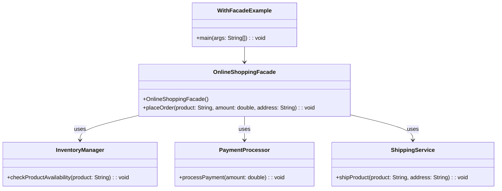

```mermaid
classDiagram
  class OnlineShoppingFacade {
    +OnlineShoppingFacade()
    +placeOrder(product: String, amount: double, address: String): void
  }

  class InventoryManager {
    +checkProductAvailability(product: String): void
  }

  class PaymentProcessor {
    +processPayment(amount: double): void
  }

  class ShippingService {
    +shipProduct(product: String, address: String): void
  }

  class WithFacadeExample {
    +main(args: String[]): void
  }

  OnlineShoppingFacade --> InventoryManager: uses
  OnlineShoppingFacade --> PaymentProcessor: uses
  OnlineShoppingFacade --> ShippingService: uses
  WithFacadeExample --> OnlineShoppingFacade

```